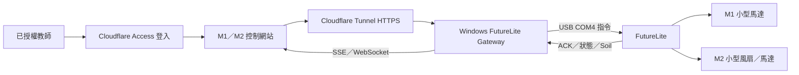

# FutureLite M1／M2 安全遠端控制研究

日期：2026-07-15

## 結論

目前最適合校內教學及現有硬件的方案，是另建「FutureLite USB Actuator Lab」，保留現有公開 MQTT 網站作 Soil／LED／通道診斷，不讓 M1／M2 經公開 Broker 接收指令。

新平台採用：

`教師瀏覽器 → Cloudflare Access → Cloudflare Tunnel → Windows USB Gateway → COM4 → FutureLite → M1／M2`

此方案毋須把 MQTT 密碼放進瀏覽器，也毋須 FutureLite 支援雲端 Broker 的 TLS 8883。使用期間，Gateway 電腦必須保持開機，FutureLite 必須保持 USB 連接。

## 已核實的硬件及環境事實

- FutureLite 主控為 ESP32-S3，板上 DRV8833 馬達驅動器支援 M1、M2 PWM 控制。
- 本機已能把 FutureLite 識別為 `COM4` 及 USB 磁碟 `E:`。
- 現場程式已成功以 `Motor().setSpeed(2, speed, 0)` 控制 M2，並以 `stopMotor(2)`停止。
- 網站與 FutureLite 已完成 Soil、LED matching ACK 及自動 Wi-Fi/MQTT 重連實測。
- 本機現時有 Node.js，但未安裝 `cloudflared`、USB serial Node 套件或 Mosquitto。
- 本機使用有線網絡，而 FutureLite 使用 Wi-Fi；已知舊板端地址與本機不在同一子網，故「校內 LAN Mosquitto」未必可直接互通。

FutureLite 官方硬件資料：<https://learn.kittenbot.cc/docs/future_lite/Hardware%20IO%20Definition>

## 方案比較

| 方案 | 可用性 | 成本 | 主要問題 | 建議 |
|---|---:|---:|---|---|
| 公開 EMQX Broker 直接控制 M1／M2 | 技術上可發訊息 | $0 | 沒有身份驗證及 topic ACL | 不採用 |
| EMQX Cloud Serverless | 有登入、ACL、免費額度 | 通常 $0 | 只開 mqtts 8883／WSS 8084；現有 `uwifi` 只驗證過普通 MQTT 1883 | 暫不採用 |
| 校內 Mosquitto | 可自訂帳號及 ACL | $0 | 有線／無線 VLAN 可能互相隔離；Gateway 要長開 | 後備方案 |
| 雲端 VPS＋Mosquitto | 可跨網絡 | 約每月 US$5 起 | 需要維護伺服器；板端普通 1883 沒有傳輸加密 | 不作第一選擇 |
| USB Gateway＋Cloudflare Access | 直接兼容現有 COM4 | $0 起 | 電腦及 USB 必須保持連接 | **首選** |

EMQX Serverless 目前提供每月 100 萬 session minutes、1 GB 流量及 username/password、topic ACL，但 Serverless 只提供 TLS 8883 及 WSS 8084：<https://docs.emqx.com/en/cloud/latest/price/plans.html>

Cloudflare Zero Trust 免費方案支援少於 50 名使用者：<https://www.cloudflare.com/plans/zero-trust-services/>

## 首選架構



Cloudflare Tunnel 由本機主動建立外連，不需開放學校防火牆的入站 port；Access 會先驗證每個網站請求。Tunnel 官方文件：<https://developers.cloudflare.com/cloudflare-one/networks/connectors/cloudflare-tunnel/configure-tunnels/>

## 網站功能

- Cloudflare Access 登入，只允許指定教師電郵。
- 顯示 USB、FutureLite、M1、M2、Soil 及程式版本狀態。
- M1「運行 3 秒」、M2「運行 3 秒」按鈕。
- 「全部停止」常駐急停按鈕。
- 只允許正轉；第一版不提供反轉。
- 顯示 command ID、發送時間、FutureLite ACK、實際停止時間及錯誤。
- 只有收到 FutureLite matching ACK 才顯示成功。
- Gateway 離線、USB 中斷或 FutureLite 無心跳時，所有運行按鈕停用。

## FutureLite USB 指令合約

Gateway 以一行一個 JSON 經 COM4 發送：

```json
{
  "id": "cmd-uuid",
  "motor": "M1",
  "action": "run",
  "speed": 35,
  "duration_ms": 3000,
  "seq": 101
}
```

板端只接受：

- `motor`：`M1` 或 `M2`
- `action`：`run` 或 `stop`
- `speed`：0–50；預設 35
- `duration_ms`：500–5000；預設 3000
- `seq`：必須大於上一個已執行序號
- 重複 `id` 不再次啟動，只重發 ACK

板端回覆：

```json
{
  "type": "ack",
  "id": "cmd-uuid",
  "ok": true,
  "motor": "M1",
  "state": "running",
  "will_stop_ms": 3000
}
```

自動停止後再回覆 `state: stopped`。

## 板端安全閘門

1. 上電、程式啟動及例外時立即停止 M1、M2。
2. 馬達不得無限期 `ON`；每次最多 5 秒。
3. USB 心跳中斷不延長現有指令，逾時必停。
4. `M` 鍵為現場「全部停止」。
5. A／B 可保留為 M1／M2 本機限時測試。
6. 第一版速度上限 50%，不提供反轉。
7. 不接受缺少 ID、非法 JSON、過期序號或超出範圍的命令。
8. Gateway 及網站不保存 Wi-Fi 密碼、板端密鑰或學生資料。

## Gateway 組件

- Node.js TypeScript 服務。
- `serialport`：獨佔開啟 COM4，傳送指令及接收 ACK／telemetry。
- HTTP API：`POST /api/motors/M1/run`、`POST /api/motors/M2/run`、`POST /api/stop-all`。
- SSE／WebSocket：推送 Soil、M1/M2、ACK 及 USB 狀態。
- 只監聽 `127.0.0.1`，不直接開放校內網絡。
- Cloudflare Tunnel 只把 Access 保護後的 HTTPS 流量轉入 Gateway。
- Gateway 啟動、退出、COM4 中斷時均嘗試送出 `stop-all`。

Cloudflare Worker／Gateway secrets 必須以加密 Secret 保存，不寫進前端 bundle：<https://developers.cloudflare.com/workers/configuration/secrets/>

## 實施階段

### 第一階段：USB 本機閉環

- 建立獨立資料夾及 Site ID：`lwwf-futurelite-actuator-lab`。
- 建立 USB Gateway。
- 把 FutureLite 板端升級為 USB 指令版，但保留目前 `code.py` 備份。
- 先在 localhost 驗證 M1、M2 各運行 3 秒及自動停止。

### 第二階段：登入及遠端

- 安裝 `cloudflared`。
- 建立 Cloudflare Tunnel。
- 建立 Cloudflare Access 應用，以指定教師電郵或 One-Time PIN 登入。
- 部署控制網站；網站完全不持有 COM、MQTT 或 Gateway secret。

### 第三階段：教學驗收

- USB 中斷測試。
- 網絡中斷測試。
- Gateway 強制結束測試。
- 連續 20 次 M1／M2 指令 matching ACK 測試。
- 速度及 duration 越界測試。
- 桌面及手機介面測試。
- 所有測試結束時確認 M1、M2 均停止。

## 必要前提

- 控制期間 Windows Gateway 電腦保持開機。
- FutureLite 保持 USB 連接 COM4。
- 首次建立 Cloudflare Access 時，需要使用者確認授權教師電郵及完成一次登入。
- 若日後希望不依賴此電腦，可把相同 Gateway 搬到 Raspberry Pi 或專用迷你電腦。

## 專案界線

現有 `lwwf-futurelite-iot-lab` 繼續作公開、非敏感的 Soil／LED／MQTT 診斷站，不加入 M1／M2 控制。M1／M2 必須由獨立、登入保護、USB Gateway 架構的 `lwwf-futurelite-actuator-lab` 提供。
